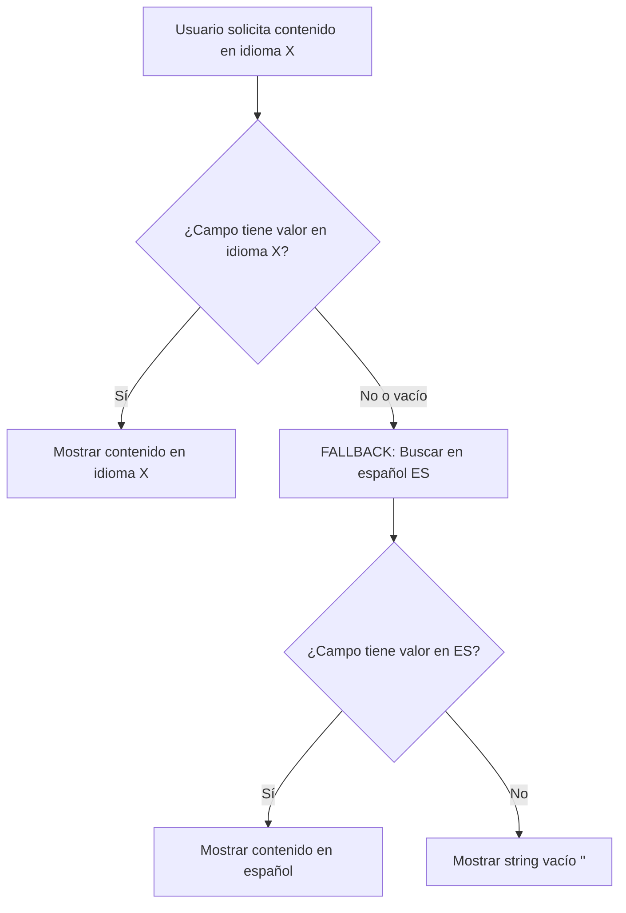

# Especificación: Sistema de Fallback Multiidioma

**Fecha**: 2025-12-04
**Versión**: 1.0
**Estado**: ✅ Implementado

---

## 🎯 Objetivo

Establecer una **norma global** para el manejo de contenido multiidioma en SAUWA, garantizando que siempre se muestre contenido al usuario incluso si la traducción solicitada no está disponible.

---

## 📋 Norma Global de Fallback

### Regla Principal

> **Si un campo ACF está vacío o null en el idioma solicitado, SIEMPRE hacer fallback al español (ES), que es el idioma base del sistema.**

### Jerarquía de Idiomas

1. **ES (Español)** - Idioma base, siempre completo
2. **CA (Catalán)** - Idioma regional principal
3. **EN (Inglés)** - Idioma internacional
4. **FR (Francés)** - Idioma secundario

### Comportamiento Esperado

```typescript
// Ejemplo: Campo título de sesión
// Usuario solicita versión en inglés (EN)

// Datos en WordPress:
{
  title: "Jornadas de puertas abiertas",  // ES (siempre presente)
  tituloCa: "Jornades de portes obertes",  // CA (disponible)
  tituloEn: null,                           // EN (vacío)
  tituloFr: null                            // FR (vacío)
}

// Resultado para cada idioma:
getLocalizedValue(data, 'es') → "Jornadas de puertas abiertas"  // Español
getLocalizedValue(data, 'ca') → "Jornades de portes obertes"    // Catalán
getLocalizedValue(data, 'en') → "Jornadas de puertas abiertas"  // Fallback a ES
getLocalizedValue(data, 'fr') → "Jornadas de puertas abiertas"  // Fallback a ES
```

---

## 🛠️ Implementación Técnica

### Utilidad Centralizada

**Ubicación**: `src/lib/i18n/fallback.ts`

```typescript
export function getLocalizedValue(
  values: {
    es?: string | null;
    ca?: string | null;
    en?: string | null;
    fr?: string | null;
  },
  locale: Locale
): string {
  // 1. Obtener valor en idioma solicitado
  const localizedValue = values[locale];

  // 2. Si existe y no está vacío, devolverlo
  if (localizedValue && localizedValue.trim() !== '') {
    return localizedValue;
  }

  // 3. FALLBACK: Siempre devolver español (idioma base)
  return values.es || '';
}
```

### Funciones Disponibles

#### 1. `getLocalizedValue()` - Un campo
```typescript
const title = getLocalizedValue({
  es: 'Título ES',
  ca: 'Títol CA',
  en: null,
  fr: null
}, 'en'); // → 'Título ES' (fallback)
```

#### 2. `getLocalizedFields()` - Múltiples campos
```typescript
const fields = getLocalizedFields({
  title: { es: 'Título', ca: 'Títol', en: null, fr: null },
  subtitle: { es: 'Subtítulo', ca: null, en: null, fr: null }
}, 'ca');
// → { title: 'Títol', subtitle: 'Subtítulo' }
```

#### 3. `hasTranslation()` - Verificar existencia
```typescript
const hasCatalan = hasTranslation({
  es: 'Título',
  ca: 'Títol',
  en: null,
  fr: null
}, 'ca'); // → true
```

---

## 📦 Campos ACF Multiidioma

### Convención de Nombres

Los campos ACF siguen esta convención de sufijos:

| Idioma   | Sufijo | Ejemplo            |
|----------|--------|--------------------|
| Español  | _(sin)_| `titulo`, `subtitulo` |
| Catalán  | `Ca`   | `tituloCa`, `subtituloCa` |
| Inglés   | `En`   | `tituloEn`, `sessionSubtitleEn` |
| Francés  | `Fr`   | `tituloFr`, `subtituloFr` |

### Campos Implementados

#### Sesiones (Sessions)
- **Título**: `title` (ES), `tituloCa`, `tituloEn`, `tituloFr`
- **Subtítulo**: `subtitulo` (ES), `subtituloCa`, `sessionSubtitleEn`, `subtituloFr`
- **Descripción**: `content` (ES), `sessionDescriptionCa`, `sessionDescriptionEn`, `sessionDescriptionFr`

#### Partners
- **Hero Image**: `partnerHeroImage` (compartido, no requiere traducción)

---

## ✅ Uso en Componentes

### Ejemplo: Página de Partner

```typescript
import { getLocalizedValue } from '../../../lib/i18n/fallback';

// En el renderizado de sesiones
const localizedTitle = getLocalizedValue(
  {
    es: session.title,
    ca: session.localizedTitle?.ca,
    en: session.localizedTitle?.en,
    fr: session.localizedTitle?.fr,
  },
  locale as Locale
);

const subtitle = getLocalizedValue(
  {
    es: session.subtitle?.es,
    ca: session.subtitle?.ca,
    en: session.subtitle?.en,
    fr: session.subtitle?.fr,
  },
  locale as Locale
);
```

### Ejemplo: Utilidad de Sesiones

```typescript
import { getLocalizedFields } from './fallback';

export function getLocalizedSession(session: SaunaSession, lang: Locale) {
  return getLocalizedFields(
    {
      title: {
        es: session.title,
        ca: session.sessionDetails.tituloCa,
        en: session.sessionDetails.tituloEn,
        fr: session.sessionDetails.tituloFr,
      },
      subtitle: {
        es: session.sessionDetails.subtitulo,
        ca: session.sessionDetails.subtituloCa,
        en: session.sessionDetails.sessionSubtitleEn,
        fr: session.sessionDetails.subtituloFr,
      },
      description: {
        es: session.content,
        ca: session.sessionDetails.sessionDescriptionCa,
        en: session.sessionDetails.sessionDescriptionEn,
        fr: session.sessionDetails.sessionDescriptionFr,
      },
    },
    lang
  );
}
```

---

## 🚀 Flujo de Datos



---

## ⚠️ Consideraciones Importantes

### 1. Español Siempre Completo
El español (ES) debe ser el único idioma **obligatorio** en WordPress. Todos los campos base deben estar completos en español.

### 2. Campos Vacíos vs Null
La utilidad trata `null`, `undefined` y strings vacíos (`''`, `'   '`) de la misma manera → fallback a español.

### 3. No Mezclar Idiomas en un Mismo Campo
Si un campo tiene traducción parcial, siempre mostrar el campo completo en un solo idioma (nunca mezclar "Título CA" con "Descripción ES" en el mismo bloque).

### 4. Validación en Build Time
Astro valida en tiempo de construcción que todos los campos base (ES) tengan contenido. Si falta contenido en español, la build fallará.

---

## 📊 Ventajas del Sistema

✅ **Garantía de Contenido**: Nunca se muestran campos vacíos al usuario
✅ **Mantenimiento Simple**: Solo es obligatorio completar español
✅ **Escalabilidad**: Fácil añadir nuevos idiomas sin romper existentes
✅ **Consistencia**: Comportamiento uniforme en toda la aplicación
✅ **SEO**: Siempre hay contenido indexable incluso sin traducción

---

## 🔄 Roadmap

### Fase 1: ✅ Implementado
- Utilidad centralizada de fallback (`src/lib/i18n/fallback.ts`)
- Integración en sesiones y partners
- **Sistema de fallback para blog posts** (`src/lib/blog-queries.ts`)
- Documentación completa

### Fase 2: 🔜 Próximo
- Extender a otros Custom Post Types (packs, eventos)
- Hook de validación para asegurar contenido ES completo
- Panel de administración para ver cobertura de traducciones

### Fase 3: 📅 Futuro
- Sistema de notificaciones cuando faltan traducciones
- API para obtener estadísticas de cobertura por idioma
- Integración con servicios de traducción automática

---

## 📝 Sistema de Fallback para Blog Posts

### Problema Identificado

En versiones anteriores, cuando un usuario visitaba `/ca/guia-sauwa-sauna/` y no había posts traducidos al catalán, la página aparecía **vacía**. Esto genera una mala experiencia de usuario y problemas de SEO.

### Solución Implementada

**Ubicación**: `src/lib/blog-queries.ts`

#### Estrategia de Fallback

```typescript
function filterPostsWithFallback(posts, requestedLocale, limit) {
  // 1. Filtrar posts en idioma solicitado
  const postsInRequestedLanguage = posts.filter(
    post => post.language?.code === requestedLocale
  );

  // 2. Si hay suficientes, devolverlos
  if (postsInRequestedLanguage.length >= limit) {
    return postsInRequestedLanguage.slice(0, limit);
  }

  // 3. FALLBACK: Completar con posts en español
  const fallbackPosts = posts.filter(
    post => post.language?.code === 'ES' && !isDuplicate(post)
  );

  // 4. Combinar: posts solicitados + fallback español
  return [...postsInRequestedLanguage, ...fallbackPosts].slice(0, limit);
}
```

#### Comportamiento Resultante

**Ejemplo: Usuario en `/ca/guia-sauwa-sauna/`**

| Escenario | Contenido Disponible | Resultado |
|-----------|---------------------|-----------|
| Hay 9+ posts en CA | 9 posts en catalán | Muestra 9 posts CA |
| Hay 3 posts en CA | 3 CA + 6 ES | Muestra 3 CA + 6 ES |
| No hay posts en CA | 9 ES | Muestra 9 ES (fallback completo) |

### Ventajas

✅ **Nunca páginas vacías**: Siempre hay contenido
✅ **Prioriza traducción**: Primero muestra posts traducidos
✅ **SEO mejorado**: Content indexable en todas las versiones
✅ **UX consistente**: Experiencia uniforme entre idiomas
✅ **Incentiva traducción**: Los posts traducidos aparecen primero

### Diferencia con Enfoque Anterior

**❌ Antes** (Filtro estricto por idioma):
```graphql
query GetBlogPosts($lang: LanguageCodeFilterEnum!) {
  posts(where: { language: $lang }) { ... }
}
```
Resultado: `/ca/guia-sauwa-sauna/` vacío si no hay posts en catalán.

**✅ Ahora** (Sin filtro + fallback client-side):
```graphql
query GetBlogPosts {
  posts(where: { ... }) { ... }
}
```
Resultado: `/ca/guia-sauwa-sauna/` muestra posts CA primero, luego ES como fallback.

---

## 📚 Referencias

### Código
- **Utilidad centralizada**: `src/lib/i18n/fallback.ts`
- **Sesiones**: `src/lib/i18n/sessions.ts`
- **Blog posts**: `src/lib/blog-queries.ts` (función `filterPostsWithFallback`)

### Ejemplos de uso
- **Partner page**: `src/pages/[locale]/[partnerSlug]/index.astro`
- **Blog grid**: `src/components/blog/BlogGrid.astro`

### Documentación
- **README**: `src/lib/i18n/README.md`
- **ADR**: [ADR-004-multi-language-fallback.md](../adr/ADR-004-multi-language-fallback.md) _(pendiente)_

---

**Última actualización**: 2025-12-04
**Autor**: Claude Code + Moisés
**Revisión**: Pendiente
