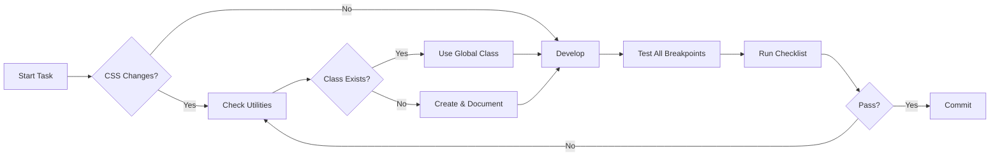

# SAUWA Documentation Hub

## TL;DR

Complete technical documentation for SAUWA project. WordPress Headless + Astro SSG. 4 languages. Design system enforced. CSS architecture mandatory. Check critical rules before coding.

## 🚨 Critical Documentation - READ FIRST

| Document | Purpose | When to Read |
|----------|---------|--------------|
| 🔴 [CSS Architecture](./architecture/css-architecture.md) | Complete CSS system design | BEFORE writing any styles |
| 🔴 [CSS Best Practices](./best-practices/css-best-practices.md) | Mandatory implementation rules | BEFORE creating components |
| 🔴 [Common Pitfalls](./best-practices/common-pitfalls.md) | Mistakes that MUST NOT happen | BEFORE starting development |
| 🔴 [Testing Checklist](./workflows/testing-checklist.md) | Pre-commit validation | BEFORE every commit |

## Project Overview

**Client**: SAUWA
**Stack**: WordPress Headless + Astro + WPGraphQL
**Timeline**: Sep 2025 - Dec 2025
**Status**: Landing Complete, Booking System Next

## Documentation Structure

```
docs/
├── architecture/           # System design & technical architecture
│   ├── css-architecture.md    ← CSS system (CRITICAL)
│   ├── astro-structure.md     ← Frontend architecture
│   └── wordpress-integration.md ← Backend integration
├── best-practices/         # Development guidelines
│   ├── css-best-practices.md  ← CSS rules (MANDATORY)
│   ├── component-guidelines.md ← Component creation
│   └── common-pitfalls.md     ← Mistakes to avoid
├── workflows/              # Development processes
│   ├── development-workflow.md ← Dev process
│   └── testing-checklist.md   ← Pre-commit checks
├── GUIDELINE/              # Design system
│   ├── 01-FOUNDATION/         ← Colors, typography
│   ├── 02-COMPONENTS/         ← UI components
│   ├── 03-PATTERNS/           ← Design patterns
│   └── README.md              ← Design system index
├── history/                # Historical documents
│   ├── WDA-531-diagnosis.md   ← CSS issue analysis
│   └── css-refactor-plan.md   ← Refactor planning
└── README.md               # This file
```

## Quick Links by Role

### Frontend Developer

1. **Start Here**:
   - [CSS Architecture](./architecture/css-architecture.md)
   - [Testing Checklist](./workflows/testing-checklist.md)

2. **Daily Reference**:
   - [Design Tokens](/src/styles/design-tokens.css)
   - [Utility Classes](/src/styles/utilities.css)
   - [GUIDELINE](./GUIDELINE/README.md)

3. **Problem Solving**:
   - [Common Pitfalls](./best-practices/common-pitfalls.md)
   - [CSS Best Practices](./best-practices/css-best-practices.md)

### Backend Developer

1. **Architecture**:
   - [WordPress Integration](./architecture/wordpress-integration.md)
   - [GraphQL Reference](./graphql-queries-reference.md)

2. **Implementation**:
   - [WordPress Setup](./implementation/wordpress-setup.md)
   - [API Documentation](./reference/api.md)

### New Team Member

**Day 1 - Understand the System**:
1. Read [Project Context](/CLAUDE.md)
2. Review [CSS Architecture](./architecture/css-architecture.md)
3. Study [Common Pitfalls](./best-practices/common-pitfalls.md)

**Day 2 - Setup & Practice**:
1. Follow [Development Setup](/README.md)
2. Review [GUIDELINE](./GUIDELINE/README.md)
3. Complete [Testing Checklist](./workflows/testing-checklist.md)

## CSS System Summary

### The 5 Golden Rules

1. **NO hardcoded values** - Always use variables
2. **NO duplicate styles** - Check global classes first
3. **NO inline styles** - Use utility classes
4. **NO pixel values** - Use rem/variables
5. **NO !important** - Fix specificity instead

### Quick Reference

```css
/* Colors */
var(--color-primary)        /* #BA2515 Red */
var(--color-primary-hover)  /* #DB4529 Orange */
var(--color-b2b)           /* #406E51 Green */

/* Typography */
.section-label              /* Small uppercase */
.section-title              /* Main headings */
.section-description        /* Body text */

/* Spacing */
var(--spacing-4)           /* 1rem / 16px */
var(--spacing-6)           /* 2rem / 32px */
var(--spacing-8)           /* 3rem / 48px */

/* Containers */
.container                  /* Max 1400px */
.container--narrow          /* Max 1200px */
.section                    /* Standard padding */
```

## Development Workflow



## Recent Updates

### November 9, 2025 - CSS Architecture Overhaul
- Complete refactoring after WDA-531 incident
- New documentation structure
- Mandatory compliance rules
- Automated validation tools

### October 2025 - Design System v2.0
- Section header patterns documented
- Typography system standardized
- Component library expanded

## Validation Tools

### Pre-Commit Check
```bash
# Run before EVERY commit
npm run css:check

# Manual check
grep -r "#[0-9a-fA-F]\{3,6\}" src/  # Find hardcoded colors
grep -r "[0-9]\+px" src/             # Find pixel values
```

### CSS Health Report
```bash
npm run css:audit
# Shows: duplication %, bundle size, specificity issues
```

## Support & Escalation

### Getting Help

1. **CSS Issues**: Check [Common Pitfalls](./best-practices/common-pitfalls.md)
2. **Architecture Questions**: Review [CSS Architecture](./architecture/css-architecture.md)
3. **Design Questions**: Consult [GUIDELINE](./GUIDELINE/README.md)
4. **Still Stuck**: Post in #frontend-help with:
   - Screenshot of issue
   - Code snippet
   - What you've tried

### Reporting Issues

Found a documentation error or gap?

1. Check if already documented in [history/](./history/)
2. Create Linear ticket with `docs` label
3. Tag in daily standup

## Maintenance Schedule

| Document | Review Frequency | Owner |
|----------|-----------------|-------|
| CSS Architecture | Monthly | Frontend Lead |
| Best Practices | Bi-weekly | Team |
| Testing Checklist | Weekly | QA |
| GUIDELINE | Per Epic | Design |

## Quick Wins

### If you only read 3 things:
1. [CSS Golden Rules](#the-5-golden-rules)
2. [Common Pitfalls](./best-practices/common-pitfalls.md#critical-incident-wda-531-style-duplication)
3. [Testing Checklist](./workflows/testing-checklist.md#pre-commit-checklist-developer)

### Before your first PR:
- [ ] Read CSS Architecture
- [ ] Understand global classes
- [ ] Know the testing checklist
- [ ] Have validation scripts ready

## Version History

- **v2.0.0** (2025-11-09): CSS architecture overhaul, documentation restructure
- **v1.1.0** (2025-10-20): Design system documentation
- **v1.0.0** (2025-10-04): Initial documentation

---

**Remember**: Good documentation prevents bad code. Every minute reading saves hours debugging.