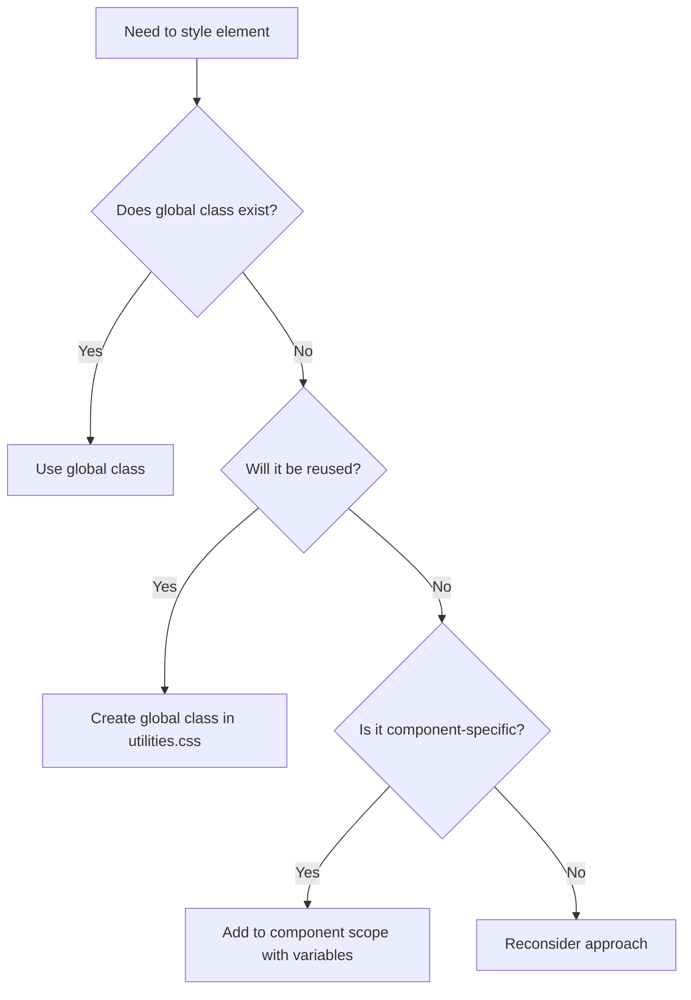

# CSS Best Practices - SAUWA Project

## TL;DR

NEVER hardcode values. ALWAYS use variables. FIRST try global classes. ONLY create scoped styles for truly unique patterns. Check if class exists before creating new one. Follow BEM for modifiers.

## Golden Rules

### Rule 1: Variables Over Values
```css
/* ✅ CORRECT */
.element {
  color: var(--color-primary);
  font-size: var(--font-scale-base);
  margin: var(--spacing-4);
}

/* ❌ WRONG */
.element {
  color: #BA2515;
  font-size: 18px;
  margin: 1rem;
}
```

### Rule 2: Global Classes First
```astro
<!-- ✅ CORRECT: Use existing global classes -->
<h2 class="section-label section-label--b2b">PARTNERS</h2>
<h3 class="section-title">Join Our Network</h3>

<!-- ❌ WRONG: Creating custom styles -->
<h2 class="partners__label">PARTNERS</h2>
<style>
  .partners__label {
    font-size: 1rem;
    text-transform: uppercase;
    /* Duplicating global styles */
  }
</style>
```

### Rule 3: Composition Over Duplication
```astro
<!-- ✅ CORRECT: Compose with utility classes -->
<div class="container container--narrow section section--compact">
  <header class="text-center mb-8">
    <h2 class="section-label section-label--primary">...</h2>
  </header>
</div>

<!-- ❌ WRONG: Custom wrapper with duplicate styles -->
<div class="custom-wrapper">
  <style>
    .custom-wrapper {
      max-width: 1200px;
      margin: 0 auto;
      padding: 4rem 0;
    }
  </style>
</div>
```

## Decision Tree



## Common Patterns & Solutions

### Typography Hierarchy

```css
/* ALWAYS use these classes for text hierarchy */
.section-label        /* H2: Small uppercase labels */
.section-title        /* H3: Main section headings */
.section-description  /* P: Descriptive text */
.card-title          /* H4: Card headings */
.text-small          /* Small text elements */
```

### Spacing System

```css
/* Use spacing variables consistently */
.mb-4 { margin-bottom: var(--spacing-4); }
.mt-6 { margin-top: var(--spacing-6); }
.py-8 { padding: var(--spacing-8) 0; }
.px-5 { padding: 0 var(--spacing-5); }

/* NEVER use arbitrary values */
/* ❌ margin-bottom: 23px; */
/* ❌ padding: 1.75rem 2.3rem; */
```

### Mobile Container Padding (WDA-535)

```css
/* ✅ CORRECT: Use container padding variable */
@media (max-width: 767px) {
  .my-section {
    padding: 2rem var(--container-padding-mobile); /* 20px */
  }
}

/* ❌ WRONG: Hardcoded mobile padding */
@media (max-width: 767px) {
  .my-section {
    padding: 2rem 1.5rem; /* Hardcoded 24px */
  }
}

/* Standard mobile horizontal padding: 20px */
/* Desktop horizontal padding: 24px */
/* ALWAYS use var(--container-padding-mobile) in mobile breakpoints */
```

### Color Usage

```css
/* Brand colors - use variables */
.text-primary { color: var(--color-primary); }
.bg-primary { background-color: var(--color-primary); }

/* State variations - use opacity/filters */
.btn:hover {
  background-color: var(--color-primary-hover);
  /* OR */
  filter: brightness(1.1);
}

/* NEVER hardcode hex values */
/* ❌ color: #BA2515; */
```

## Component Creation Checklist

### Before Creating New Styles

1. **Check existing utilities**
   ```bash
   # Search for similar classes
   grep -r "similar-pattern" src/styles/
   ```

2. **Try composition first**
   ```astro
   <!-- Combine existing classes -->
   <div class="container section text-center">
   ```

3. **Use design tokens**
   ```css
   /* All values from variables */
   .new-component {
     gap: var(--spacing-4);
     border-radius: var(--radius-base);
   }
   ```

4. **Document if global**
   ```css
   /**
    * Card component - Used in blog, testimonials, features
    * @see components.css
    */
   .card { /* ... */ }
   ```

## Naming Conventions

### BEM Structure
```css
/* Block */
.card { }

/* Element */
.card__title { }
.card__content { }

/* Modifier */
.card--featured { }
.card--horizontal { }
```

### Utility Classes
```css
/* Format: property-value */
.text-center
.mb-4
.bg-light

/* Format: component-variant */
.btn--primary
.section--compact
.container--narrow
```

### State Classes
```css
/* Prefixed with is-/has- */
.is-active
.is-loading
.has-error
.has-children
```

## Responsive Design

### Mobile-First Approach
```css
/* Base (mobile) styles */
.element {
  font-size: var(--font-scale-sm);
  padding: var(--spacing-4);
}

/* Tablet and up */
@media (min-width: 768px) {
  .element {
    font-size: var(--font-scale-base);
    padding: var(--spacing-6);
  }
}

/* Desktop */
@media (min-width: 1024px) {
  .element {
    font-size: var(--font-scale-lg);
    padding: var(--spacing-8);
  }
}
```

### Fluid Typography
```css
/* Use clamp() for responsive text */
font-size: clamp(
  1rem,    /* Minimum */
  2vw,     /* Preferred */
  1.5rem   /* Maximum */
);
```

## Code Examples

### ✅ GOOD: Section Component
```astro
---
interface Props {
  variant?: 'default' | 'compact' | 'spacious';
  background?: 'white' | 'light' | 'gradient';
  width?: 'default' | 'narrow' | 'wide';
}

const {
  variant = 'default',
  background = 'white',
  width = 'default'
} = Astro.props;

const sectionClass = `section${variant !== 'default' ? ` section--${variant}` : ''}`;
const containerClass = `container${width !== 'default' ? ` container--${width}` : ''}`;
const bgClass = background !== 'white' ? `bg-${background}` : '';
---

<section class={`${sectionClass} ${bgClass}`.trim()}>
  <div class={containerClass}>
    <slot />
  </div>
</section>

<style>
  /* Only truly unique styles */
  .bg-gradient {
    background: linear-gradient(
      180deg,
      var(--color-bg-light) 0%,
      var(--color-bg-white) 100%
    );
  }
</style>
```

### ❌ BAD: Section Component
```astro
<section class="my-section">
  <div class="my-container">
    <slot />
  </div>
</section>

<style>
  .my-section {
    padding: 5rem 0;  /* ❌ Hardcoded */
  }

  .my-container {
    max-width: 1400px;  /* ❌ Duplicate of .container */
    margin: 0 auto;     /* ❌ Duplicate of .container */
    padding: 0 1.5rem;  /* ❌ Hardcoded */
  }
</style>
```

## Testing & Validation

### Pre-Commit Checklist

```markdown
- [ ] No hardcoded colors (search for #[0-9a-fA-F]{3,6})
- [ ] No hardcoded font-sizes (search for \d+px|\d+rem)
- [ ] No duplicate class definitions
- [ ] All values use CSS variables
- [ ] Global classes used where available
- [ ] New patterns documented
```

### CSS Audit Commands

```bash
# Find hardcoded colors
grep -r "#[0-9a-fA-F]\{3,6\}" src/

# Find hardcoded sizes
grep -r "[0-9]\+px\|[0-9.]\+rem" src/

# Find duplicate selectors
npx csscomb src/styles/

# Analyze CSS stats
npx wallace src/styles/
```

## Anti-Patterns to Avoid

### 1. Inline Styles in Components
```astro
<!-- ❌ NEVER -->
<div style="margin: 20px; color: #BA2515;">
```

### 2. Important Overrides
```css
/* ❌ AVOID */
.my-class {
  color: red !important;
}
```

### 3. Deep Nesting
```css
/* ❌ TOO SPECIFIC */
.section .container .header .title span {
  /* Specificity nightmare */
}
```

### 4. Magic Numbers
```css
/* ❌ UNEXPLAINED VALUES */
.element {
  top: 37px;  /* Why 37? */
  left: 23%;  /* Why 23? */
}
```

### 5. Pixel-Perfect Matching
```css
/* ❌ FRAGILE */
.element {
  width: 247px;  /* Breaks on different screens */
}
```

## Migration Guide

### Step 1: Identify Duplicates
```bash
# Run CSS analysis
npx cssstats dist/styles.css
```

### Step 2: Extract to Variables
```css
/* Before */
.component { color: #BA2515; }

/* After */
.component { color: var(--color-primary); }
```

### Step 3: Create Utility Classes
```css
/* Before: Multiple components with same style */
.header-title { font-size: 2rem; font-weight: 300; }
.card-title { font-size: 2rem; font-weight: 300; }

/* After: Single utility class */
.title-large {
  font-size: var(--font-scale-xl);
  font-weight: var(--font-weight-light);
}
```

### Step 4: Update Components
```astro
<!-- Before -->
<h2 class="custom-title">Title</h2>

<!-- After -->
<h2 class="section-title">Title</h2>
```

## Performance Considerations

### CSS Bundle Size
- Target: < 50KB minified
- Current: Check with `ls -lh dist/styles.css`

### Specificity Budget
- Maximum nesting: 3 levels
- Avoid ID selectors
- Minimize !important usage (target: 0)

### Load Strategy
```html
<!-- Critical CSS inline -->
<style>
  /* Minimal above-fold styles */
</style>

<!-- Main CSS async -->
<link rel="preload" href="/styles/main.css" as="style">
<link rel="stylesheet" href="/styles/main.css">
```

## Resources

- [CSS Architecture](/docs/architecture/css-architecture.md)
- [Design Tokens](/src/styles/design-tokens.css)
- [Utility Classes](/src/styles/utilities.css)
- [Component Guidelines](./component-guidelines.md)

---

**Remember**: Every line of CSS should be intentional, reusable, and maintainable.