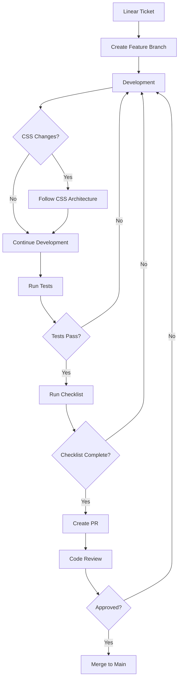

# Development Workflow - SAUWA Project

## TL;DR

Git flow with feature branches. CSS system mandatory. Test all breakpoints. PR requires checklist completion. No direct commits to main.

## Development Flow



## Branch Strategy

### Branch Naming
```bash
# Format: type/ticket-description
feature/WDA-123-booking-system
fix/WDA-456-mobile-nav
refactor/WDA-789-css-architecture
docs/WDA-321-update-readme
```

### Branch Types
- `feature/` - New functionality
- `fix/` - Bug fixes
- `refactor/` - Code improvements
- `docs/` - Documentation only
- `hotfix/` - Emergency production fixes

## Step-by-Step Workflow

### 1. Start New Task

```bash
# Get latest code
git checkout main
git pull origin main

# Create feature branch
git checkout -b feature/WDA-XXX-description

# Verify clean start
git status
```

### 2. Development Phase

#### CSS Development
```bash
# BEFORE writing CSS
cat docs/architecture/css-architecture.md
cat docs/best-practices/css-best-practices.md

# Check for existing classes
grep -r "similar-pattern" src/styles/

# Use design tokens
cat src/styles/design-tokens.css
cat src/styles/utilities.css
```

#### Component Development
```bash
# Check existing components
ls src/components/

# Follow component guidelines
cat docs/best-practices/component-guidelines.md

# Copy component template
cp src/components/_Template.astro src/components/NewComponent.astro
```

### 3. Testing Phase

#### Local Testing
```bash
# Start dev server
npm run dev

# Test breakpoints
# Mobile: 320px, 375px, 414px
# Tablet: 768px, 834px
# Desktop: 1024px, 1440px

# Run linting
npm run lint

# Check for CSS issues
grep -r "#[0-9a-fA-F]\{3,6\}" src/
grep -r "[0-9]\+px" src/
```

#### Build Testing
```bash
# Build project
npm run build

# Check build size
ls -lh dist/

# Preview production build
npm run preview
```

### 4. Pre-Commit Checklist

```markdown
## CSS Checklist
- [ ] NO hardcoded colors (use variables)
- [ ] NO pixel values (use rem/variables)
- [ ] NO duplicate styles
- [ ] Used global classes where available
- [ ] Tested on mobile/tablet/desktop

## General Checklist
- [ ] Code follows project standards
- [ ] All tests pass
- [ ] No console errors
- [ ] Documentation updated if needed
- [ ] Linear ticket referenced in commit
```

### 5. Commit Guidelines

#### Commit Message Format
```bash
# Format: type(scope): description [ticket]

feat(booking): add calendar component [WDA-123]
fix(nav): correct mobile menu behavior [WDA-456]
refactor(css): consolidate typography styles [WDA-789]
docs(readme): update setup instructions [WDA-321]
```

#### Commit Types
- `feat:` - New feature
- `fix:` - Bug fix
- `refactor:` - Code refactoring
- `docs:` - Documentation
- `style:` - Formatting only
- `test:` - Adding tests
- `chore:` - Maintenance

#### Making Commits
```bash
# Stage changes
git add -p  # Review each change

# Commit with message
git commit -m "feat(booking): add calendar component [WDA-123]"

# Push to remote
git push origin feature/WDA-123-booking-system
```

### 6. Pull Request Process

#### PR Template
```markdown
## Description
Brief description of changes

## Linear Ticket
[WDA-XXX](https://linear.app/wdamanage/issue/WDA-XXX)

## Changes Made
- Change 1
- Change 2
- Change 3

## Testing
- [ ] Tested on mobile (375px)
- [ ] Tested on tablet (768px)
- [ ] Tested on desktop (1440px)
- [ ] No console errors
- [ ] Lighthouse score maintained

## CSS Checklist (if applicable)
- [ ] Used CSS variables
- [ ] Used global classes
- [ ] No hardcoded values
- [ ] No duplicate styles

## Screenshots
[Add screenshots for visual changes]

## Notes for Reviewers
[Any specific areas to focus on]
```

#### Creating PR
```bash
# Push branch
git push origin feature/WDA-XXX-description

# Create PR via GitHub/GitLab
# - Use PR template
# - Add reviewers
# - Link Linear ticket
# - Add labels
```

### 7. Code Review Process

#### As Reviewer
- Check CSS architecture compliance
- Verify no hardcoded values
- Test on different breakpoints
- Check for code duplication
- Verify Linear ticket requirements
- Run the code locally

#### As Author
- Respond to feedback promptly
- Make requested changes
- Re-request review after changes
- Don't merge without approval

### 8. Merge Process

```bash
# Update branch with main
git checkout main
git pull origin main
git checkout feature/WDA-XXX-description
git rebase main

# Resolve conflicts if any
# Test after rebase

# Push updated branch
git push origin feature/WDA-XXX-description --force-with-lease

# Merge via PR interface (squash and merge preferred)
```

### 9. Post-Merge

```bash
# Clean up local
git checkout main
git pull origin main
git branch -d feature/WDA-XXX-description

# Clean up remote
git push origin --delete feature/WDA-XXX-description

# Update Linear ticket
# - Mark as Done
# - Add PR link
# - Note any follow-up needed
```

## Environment Setup

### Required Tools
```bash
# Node.js 18+
node --version

# pnpm
pnpm --version

# Git
git --version

# VS Code extensions
- Astro
- Prettier
- ESLint
- Stylelint
- GitLens
```

### VS Code Settings
```json
{
  "editor.formatOnSave": true,
  "editor.defaultFormatter": "esbenp.prettier-vscode",
  "editor.codeActionsOnSave": {
    "source.fixAll.eslint": true,
    "source.fixAll.stylelint": true
  },
  "css.validate": false,
  "stylelint.enable": true,
  "files.associations": {
    "*.astro": "astro"
  }
}
```

### Git Configuration
```bash
# Set up Git
git config user.name "Your Name"
git config user.email "your.email@example.com"

# Configure line endings
git config core.autocrlf false

# Set default branch
git config init.defaultBranch main

# Enable color output
git config color.ui auto
```

## Common Commands

### Development
```bash
npm run dev          # Start dev server
npm run build        # Build for production
npm run preview      # Preview build
npm run lint         # Run linters
npm run format       # Format code
```

### CSS Validation
```bash
# Check for hardcoded colors
npm run css:check-colors

# Check for pixel values
npm run css:check-pixels

# Full CSS audit
npm run css:audit
```

### Git Shortcuts
```bash
# Show branch graph
git log --graph --oneline --all

# Undo last commit (keep changes)
git reset --soft HEAD~1

# Stash work in progress
git stash save "WIP: description"

# Apply stash
git stash pop
```

## Troubleshooting

### CSS Not Applying
1. Check if using correct global class
2. Verify variable names
3. Check specificity conflicts
4. Clear browser cache
5. Rebuild project

### Build Errors
```bash
# Clear cache and rebuild
rm -rf dist/ node_modules/.cache/
npm run build

# Check for missing dependencies
npm install
```

### Git Conflicts
```bash
# During rebase
git status
# Fix conflicts in files
git add .
git rebase --continue
```

## Emergency Procedures

### Hotfix Process
```bash
# Create hotfix from main
git checkout main
git pull origin main
git checkout -b hotfix/WDA-XXX-critical-fix

# Make minimal fix
# Test thoroughly
# Create PR with [HOTFIX] prefix
# Get expedited review
# Merge immediately after approval
```

### Rollback Procedure
```bash
# Find commit to rollback to
git log --oneline

# Create revert commit
git revert HEAD

# Or reset to specific commit
git reset --hard <commit-hash>

# Force push if necessary (careful!)
git push origin main --force-with-lease
```

## Resources

- [CSS Architecture](../architecture/css-architecture.md)
- [Component Guidelines](../best-practices/component-guidelines.md)
- [Testing Checklist](./testing-checklist.md)
- [Common Pitfalls](../best-practices/common-pitfalls.md)
- [Linear Board](https://linear.app/wdamanage/project/sauwasauna-44379947aed1)

---

**Remember**: Good process prevents bad code. Follow the workflow, use the checklists, and ask for help when needed.